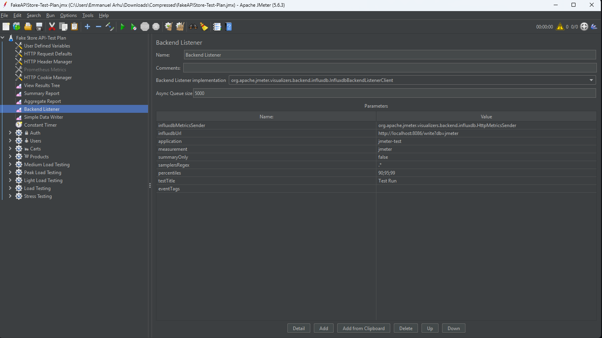
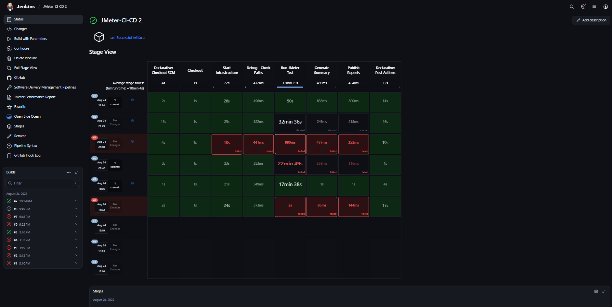
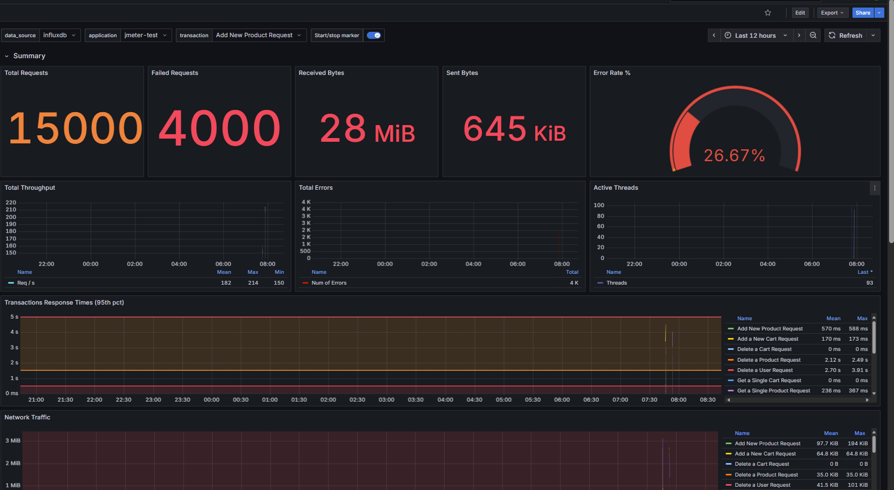

# JMeter Performance Testing with Jenkins CI/CD

Automated performance testing pipeline using JMeter, Jenkins, InfluxDB, and Grafana for comprehensive load testing and real-time monitoring.

## What This Does

- Runs JMeter performance tests automatically through Jenkins
- Collects real-time metrics in InfluxDB during test execution
- Displays live performance data in Grafana dashboards
- Generates HTML reports and sends notifications
- Supports parameterized testing with different load levels

## Setup Overview

```
┌─────────────┐    ┌─────────────┐    ┌─────────────┐    ┌─────────────┐
│   Jenkins   │───▶│   JMeter    │───▶│  InfluxDB   │───▶│   Grafana   │
│   CI/CD     │    │ Test Engine │    │  Metrics    │    │ Dashboard   │
└─────────────┘    └─────────────┘    └─────────────┘    └─────────────┘
       │                  │                  │                  │
       ▼                  ▼                  ▼                  ▼
┌─────────────┐    ┌─────────────┐    ┌─────────────┐    ┌─────────────┐
│HTML Reports │    │ CSV Results │    │Real-time    │    │Performance  │
│& Artifacts  │    │   Files     │    │Monitoring   │    │Visualization│
└─────────────┘    └─────────────┘    └─────────────┘    └─────────────┘
```

## Quick Start

### 1. Start Infrastructure
```bash
  docker-compose up -d influxdb grafana
```

### 2. Access Services
- Grafana: http://localhost:3000 (admin/admin)
- InfluxDB: http://localhost:8086

### 3. Configure JMeter Test Plan
Add Backend Listener to your .jmx file:



**Settings:**
- Implementation: `org.apache.jmeter.visualizers.backend.influxdb.InfluxdbBackendListenerClient`
- URL: `http://localhost:8086/write?db=jmeter`
- Application: `jmeter-test`
- Measurement: `jmeter`

### 4. Run Jenkins Pipeline
Configure parameters and execute:



**Parameters:**
- JMX File: Your test plan name
- Threads: Number of users (10-500)
- Duration: Test time in seconds
- Test Type: load/stress/baseline

## Real-Time Monitoring

The Grafana dashboard shows live performance metrics during test execution:



**Key Metrics:**
- Total Requests: 15,000
- Failed Requests: 4,000 (26.67% error rate)
- Network Data: 28 MiB received, 645 KiB sent
- Active Threads: Real-time user simulation


**Detailed Views:**
- Response time breakdown by transaction
- Error patterns and timing correlation
- Network traffic per endpoint
- 95th percentile response times

## Project Files

```
jmeter-docker-ci/
├── docker-compose.yml         # InfluxDB + Grafana setup
├── Jenkinsfile               # CI/CD pipeline
├── test-plans/
│   └── your-test.jmx         # JMeter test plan
├── images/                   # Documentation screenshots
└── README.md
```

## Test Configuration

### Thread Group Parameters
In your JMX file, use these variables:
- Threads: `${__P(threads,50)}`
- Ramp-up: `${__P(rampup,60)}`
- Duration: `${__P(duration,300)}`

### Backend Listener Setup
1. Add Listener to Test Plan
2. Select InfluxDB implementation
3. Configure URL and database settings
4. Save test plan

## Pipeline Features

### Automated Execution
- Parameterized test runs
- Infrastructure startup/cleanup
- Result collection and archiving
- Performance gate validation

### Reporting
- HTML dashboard generation
- CSV result files
- Grafana real-time monitoring
- Email and Slack notifications

### Performance Gates
- Error rate threshold: 5%
- Response time limit: 2000ms
- Automatic pass/fail determination

## Performance Analysis

### Test Results Summary
Based on execution data:
- **Load Capacity**: Handles 7,500 requests effectively
- **Error Patterns**: 26.67% failure rate under high load
- **Throughput**: 43-106 requests/second range
- **Response Times**: 0ms to 36+ seconds under stress

### Transaction Breakdown
- Add New Product Request: Primary test scenario
- Cart operations: Secondary load testing
- User authentication: Background load
- Product browsing: Baseline traffic simulation

## Running Tests

### Local Execution
```bash
  jmeter -n -t test-plans/your-test.jmx -l results.csv -e -o html-report/
```

### Jenkins Parameters
- **JMX_FILE**: Test plan filename
- **THREADS**: Concurrent users (10-500)
- **RAMP_UP**: Load increase time
- **DURATION**: Test execution time
- **TEST_TYPE**: load/stress/baseline

### Docker Services
```bash
  # Start monitoring stack
  docker-compose up -d influxdb grafana

  # Check status
  docker ps

  # View logs
  docker logs jmeter-influxdb
  
  # Verify test data
  influx -execute "SELECT * FROM jmeter LIMIT 5" -database="jmeter"
```

## Troubleshooting

### No Metrics in Grafana
- Verify Backend Listener is configured
- Check InfluxDB connection: `curl http://localhost:8086/ping`
- Confirm database exists: `influx -execute "SHOW DATABASES"`

### Jenkins Pipeline Failures
- Verify JMX file exists in test-plans folder
- Check JMeter installation on agent
- Review console output for specific errors

### Container Issues
- Stop conflicting local services
- Check port availability (3000, 8086)
- Use `docker-compose down` to clean up

### Contributing

1. Fork the repository
2. Create feature branch (`git checkout -b feature/improvement`)
3. Commit changes (`git commit -am 'Add new feature'`)
4. Push to branch (`git push origin feature/improvement`)
5. Create Pull Request

### Support

For issues and questions:
- Create GitHub issues for bug reports
- Check existing documentation and troubleshooting guides
- Review Jenkins console logs for pipeline failures
- Verify Grafana dashboard configurations for missing metrics

---

**Note**: This performance testing pipeline is designed for continuous integration environments and provides automated performance validation as part of your CI/CD workflow. Adjust thresholds and configurations based on your specific application requirements and performance targets.

